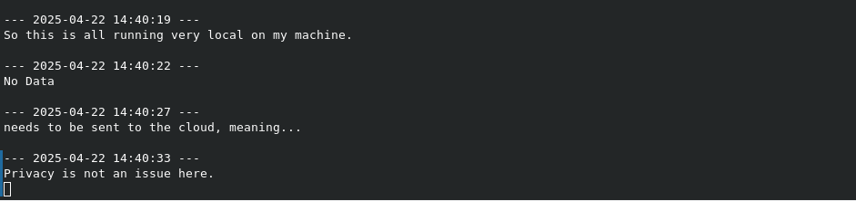

# Local ASR Listener (using Whisper)

This project provides a background service for Linux desktops (tested on Pop!\_OS/GNOME) that allows you to use system-wide hotkeys to capture audio snippets and transcribe them locally using an optimized Whisper model (`faster-whisper`). It uses Voice Activity Detection (VAD) to automatically detect speech segments for transcription.



**Features:**

- **Hotkey Driven:** Start/Pause ASR processing with global hotkeys.
- **Local Transcription:** Uses `faster-whisper` for efficient local ASR (CPU or NVIDIA GPU). Your voice data stays on your machine.
- **VAD Based Streaming:** Uses Silero VAD to detect speech and pauses, transcribing segments automatically for a near real-time feel without needing to manually stop recording for each phrase.
- **Configurable Output:** Transcribed text can be automatically:
  - Copied to the clipboard (`clipboard` method - requires `xclip` or `wl-clipboard`).
  - Typed out into the currently focused window (`type` method - requires `pynput` and potentially special permissions).
  - Appended to a file (`file` method).
- **Background Service:** Runs persistently via systemd (user service).
- **Notifications:** Provides desktop notifications for status changes (optional).
- **Configurable:** Settings managed via `~/.config/asr-indicator/config.ini`.

## Requirements

**1. System Dependencies:**

- **Python:** Python 3.9 or higher (with `venv`).
- **Core Audio:** `ffmpeg`, `libsndfile1` (for saving audio segments if needed, used by `soundfile`), `pulseaudio-utils` (for `pactl` if used for info).
  ```bash
  sudo apt update
  sudo apt install ffmpeg libsndfile1 pulseaudio-utils python3-venv
  ```
- **Output Helpers:**
  - For `clipboard` output: `xclip` (X11) or `wl-clipboard` (Wayland).
  ```bash
  sudo apt install xclip # Or wl-clipboard
  ```
  - For `type` output: (Optional, requires `pynput` Python package and may need input monitoring permissions).
- **Notifications:** `libnotify-bin` (provides `notify-send`).
  ```bash
  sudo apt install libnotify-bin
  ```
- **(Optional) Build Tools:** May be needed for some Python packages if wheels aren't available.
  ```bash
  sudo apt install build-essential pkg-config
  ```
- **(Optional) Python Dev Headers:** Needed if installing `PyGObject` via pip. Use the version matching your `venv` Python (e.g., 3.10, 3.11).
  ```bash
  # Example for Python 3.11
  sudo apt install python3.11-dev
  ```

**2. PyTorch:**

- `faster-whisper` and `silero-vad` require PyTorch. Install it separately _before_ other Python packages, following the official instructions for your system (CPU or specific CUDA version).
- **Go to:** [pytorch.org](https://pytorch.org/get-started/locally/)
- Select your preferences (Linux, Pip, Python, CPU or CUDA version).
- Run the provided `pip install ...` command **inside your activated virtual environment**.
- **Example (CPU):**
  ```bash
  # Inside your activated venv
  pip install torch torchvision torchaudio
  ```
- **Example (CUDA 12.1):**
  ```bash
  # Inside your activated venv
  pip install torch torchvision torchaudio --index-url https://download.pytorch.org/whl/cu121
  ```

**3. NVIDIA GPU (Optional but Recommended):**

- For significantly faster transcription (`device = cuda` in config).
- Requires:
  - NVIDIA Drivers installed.
  - Matching CUDA Toolkit installed system-wide.
  - cuDNN library installed system-wide.
  - PyTorch installed with the correct CUDA version (see step 2).
- Setup can be complex; follow official NVIDIA documentation for your Linux distribution.

**4. Python Dependencies:**

- Listed in `requirements.txt`.

## Setup Instructions

1.  **Clone the Repository:**
    Open your terminal and clone this repository to your preferred location:

    ```bash
    git clone https://github.com/moz-gh/listenr
    cd listenr
    ```

    _(All subsequent commands assume you are running them from within this main project directory)._

2.  **Install System Dependencies:**
    Ensure required system packages (listed in Requirements section above) are installed using `apt`.

3.  **Create & Activate Python Virtual Environment:**

    ```bash
    python3 -m venv venv
    source venv/bin/activate
    ```

4.  **IMPORTANT: Install PyTorch Separately:**
    Follow step 2 in the **Requirements** section above to install the correct PyTorch version (CPU or CUDA) _first_ within your activated `venv`.

5.  **Install Python Dependencies from `requirements.txt`:**
    Once PyTorch is installed, install the rest of the Python packages listed in the project's `requirements.txt` file:

    ```bash
    pip install --upgrade pip
    pip install -r requirements.txt
    ```

6.  **Add env file**:

    i. Copy this example.env file and rename the copy to .env in the same directory as the commander.py script (or the project root, depending on where you run it from).

    ii. Edit the .env file.

    iii. Replace "your_openai_api_key_here" with your actual OpenAI API key.

    iv. Optionally, uncomment and change OPENAI_MODEL or EDITOR if you want to override the defaults.

7.  **Create Configuration Directory & File:**
    The script will automatically create a default configuration file on its first run if it doesn't exist. Run the main script once manually (see Troubleshooting section) or start the service (Step 9) to generate it. The file will be located at:
    `~/.config/asr-indicator/config.ini`

8.  **Review and Edit `config.ini`:**
    **After the file is created**, open `~/.config/asr-indicator/config.ini` with a text editor. Review and adjust settings for your hardware and preferences:

    - **`[Whisper]`:** `model_size`, `device` (cpu/cuda), `compute_type`.
    - **`[Audio]`:** `input_device` (if not default).
    - **`[VAD]`:** `speech_threshold`, `silence_duration_ms` (important for tuning).
    - **`[Output]`:** `method` (clipboard/type/file), `output_file` (if using file).
    - **`[UI]`:** `show_notifications`, `hotkey_display`.
    - **`[Icons]`:** Icon names if defaults don't work with your theme.

9.  **Make Scripts Executable:**

    ```bash
    chmod +x main.py trigger_asr.py
    ```

10. **Set up Background Service (systemd):**

    - Create/edit `~/.config/systemd/user/asr-indicator.service`.
    - **You MUST replace `<absolute_path_to_repo>` with the actual full path where you cloned the repository.**

      ```ini
      [Unit]
      Description=ASR Listener Background Service
      After=pulseaudio.service # Or pipewire equivalent

      [Service]
      # !!! REPLACE <absolute_path_to_repo> !!!
      ExecStart=<absolute_path_to_repo>/venv/bin/python <absolute_path_to_repo>/main.py
      WorkingDirectory=<absolute_path_to_repo>
      Restart=on-failure
      RestartSec=5
      # Optional: Environment variables if needed
      # Environment="XDG_RUNTIME_DIR=/run/user/%U"

      [Install]
      WantedBy=default.target
      ```

    - Enable and start the service:

      ```bash
      systemctl --user daemon-reload
      systemctl --user enable --now asr-indicator.service

      # Check status:
      systemctl --user status asr-indicator.service

      # View logs:
      journalctl --user -u asr-indicator.service -f
      ```

    _(Note: The service needs to run at least once to generate the default config if it didn't exist)._

11. **Configure System Hotkeys:**
    - Go to Pop!\_OS Settings -> Keyboard -> View and Customize Shortcuts -> Custom Shortcuts.
    - **You MUST replace `<absolute_path_to_repo>` with the actual full path where you cloned the repository.**
    - **Add Shortcut 1 (Start/Resume):**
      - Name: `ASR Start/Resume`
      - Command: `<absolute_path_to_repo>/venv/bin/python <absolute_path_to_repo>/trigger_asr.py start`
      - Set Shortcut Key(s).
    - **Add Shortcut 2 (Pause):**
      - Name: `ASR Pause`
      - Command: `<absolute_path_to_repo>/venv/bin/python <absolute_path_to_repo>/trigger_asr.py stop`
      - Set Shortcut Key(s).

## Usage

1.  Ensure the systemd service is running (`systemctl --user status asr-indicator.service`).
2.  Press your "Start/Resume" hotkey. You should get an "ASR Activated" notification (if enabled).
3.  Speak normally. When you pause for the duration set in `silence_duration_ms`, the captured speech segment will be processed.
4.  You should get a "Processing" notification, followed by the output action (text copied, typed, or saved) and potentially a "Success" notification.
5.  Press your "Pause" hotkey to stop processing new segments. You should get an "ASR Paused" notification. Pressing "Start/Resume" again will reactivate processing.
6.  To stop the background service completely: `systemctl --user stop asr-indicator.service`.

## Troubleshooting

- **Check Service Logs:** `journalctl --user -u asr-indicator.service -f` is your best friend. Look for errors related to Python imports, file paths, audio devices, VAD, or Whisper.
- **Manual Testing:** Stop the service (`systemctl --user stop ...`). Activate the venv (`source venv/bin/activate`). Run manually: `python main.py`. Trigger using `python trigger_asr.py start/stop` in another terminal (with venv active). Observe logs directly in the first terminal.
- **Configuration:** Double-check paths and settings in `~/.config/asr-indicator/config.ini`. Ensure the file was created and saved correctly after editing. Restart the service after config changes (`systemctl --user restart asr-indicator.service`).
- **Dependencies:** Ensure all system and Python dependencies (including the correct PyTorch version) are installed in the correct environment (`venv`). Check `pip list` within the activated venv.
- **VAD Tuning:** If transcription cuts off too early or waits too long, adjust `silence_duration_ms` (milliseconds) and `speech_threshold` (0.0-1.0) in `config.ini`. Restart the service after changes.
- **Audio Device:** If no audio is recorded or VAD fails, check the `input_device` setting in `config.ini`. Use `python -m sounddevice` (with venv active) to list available devices and their names/indices. Try using an index number if 'default' fails. Ensure the `sample_rate` (16000) and `channels` (1) match VAD requirements.
- **Whisper Model:** Ensure the `model_size` exists and that you have enough RAM/VRAM. Check the `device` and `compute_type` settings match your hardware and PyTorch installation. Models are usually downloaded to `~/.cache/faster_whisper` or managed by `torch.hub`. Check service logs for model loading errors.
- **Hotkey Conflicts:** Ensure your chosen hotkeys aren't already used by the system or another application. Check the command paths in the hotkey settings carefully.

## License

This project is licensed under the **Mozilla Public License Version 2.0**. You should include a file named `LICENSE` in your repository containing the full text of the MPL 2.0 license.
